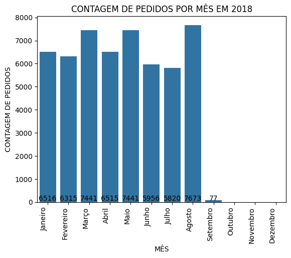
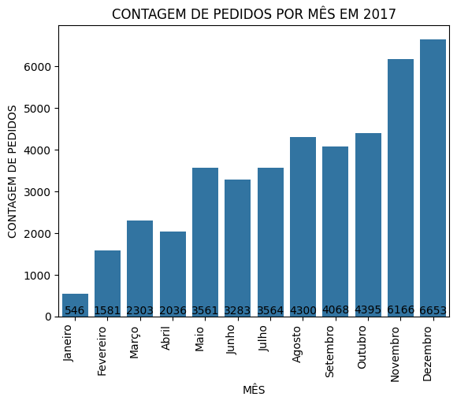
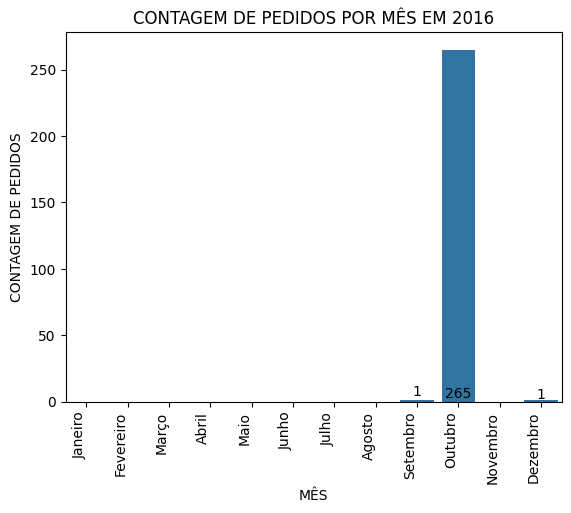
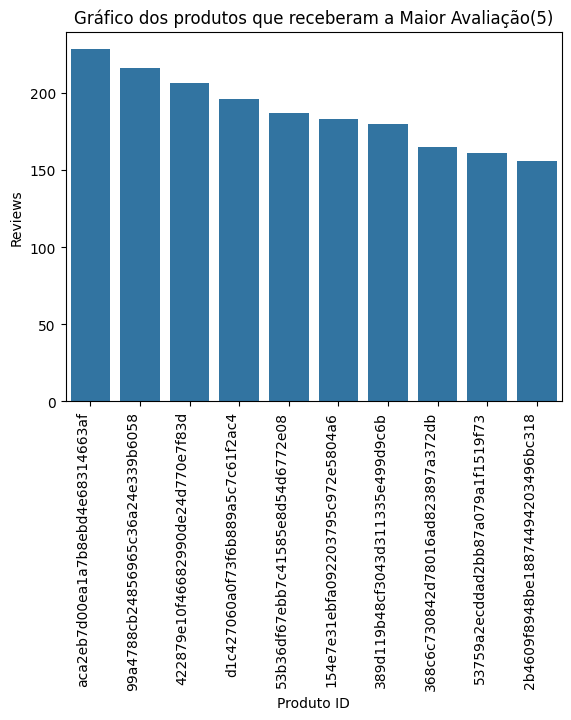
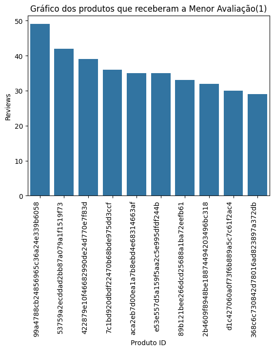
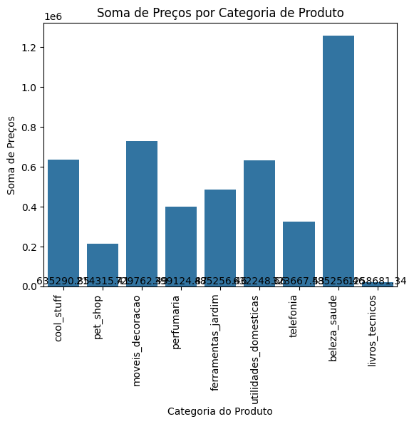

## Análise de dados públicos relacionados ao e-commerce brasileiro

## Questão 1: Análise de Performance de Vendas
### A alternativa escolhida foi a letra B, na qual pede a análise sazonal das vendas por ano.
### Começando pela identificação das bases necessáris, foi feita a extração. Em seguida filtrado apenas as informações que terão utlidade. A divisão foi feita pelos anos que tiveram pedidos realizados e a quantidade de pedidos realizada em cada mês, nos gráficos abaixo é exibido a sazonalidade por ano:
### 
###
###
### 
###
###
### 
###
###
### 
###
###
### ----------------------------------------------------
###
## Questão 2: Análise de Logística
###
### A alternativa escolhida foi a letra A, Prazos de Entrega.
### A questão pede para calcular o tempo médio de entrega e identificar os fatores que influenciam os atrasos de entrega, porém, foi possível realizar apenas a primera parte da questão, pois não foi encontrado nenhum informação nas bases de dados que fosse possível atender a essa demanda, concluindo apenas na resolução da primeira parte da questão.
### Como o resultado obtido se trata de um único valor, sendo ele a média, não há maneira de representar isso graficamente.
### RESPOSTA: Usando o tempo de aprovação dos pedidos e o dia que o cliente recebeu o produto, foi feito o cálculo de dias durante esse período, após isso foi somado o total de dias que levou para a entrega ser realizada de todos os pedidos, e por último foi feito a divisão dos dias totais pela quantidade de pedidos entregues.
### Dias_para_entrega_recebida = Data_de_recebimento - Data_de_aprovação_da_compra
### Media = soma_total_de_dias/quantidade_de_pedidos
### A média obitida foi de : 11.64 dias
### ----------------------------------------------------
###  
## Questão 3: Análise de Satisfação do Cliente
### A questão escolhida foi a letra A, Avaliações de Produtos.
### A questão pede para fazer a análise das avaliações dos clientes sobre os produtos e para mostrar os produtos com melhores e piores avaliações.
### A avaliações dos clientes foram feitas de uma nota de 1 a 5, sendo 1 a avaliação mais baixa e a 5 mais alta.
### Para a resolução do problema foi feito o mesmo processo de extração e identificação das informações relevantes para a resolução da questão.
### Em seguida foi feita duas contagens: para produtos que receberam a maior avaliação(5) e para os produtos que receberam a menor avaliação(1).
### Cada uma das contagens foi listada de acordo com a quantidade de avaliações com cada nota específica, ou seja, os produtos que receberam mais avaliação 5 e 1, em ordem decrescente. Abaixo pode-ser observar nos 2 gráficos abaixo os 10 produtos que receberam mais avaliações 5 e 1, na respectiva ordem.
### 
###
###
### 
###
### ---------------------------------------------------
###
## Questão 4: Análise Financeira
###
### A questão escolhida foi a letra A, Análise de Lucratividade por categoria. Nessa questão houve outro problema, não havia em nenhuma base de dados informações sobre o custo dos produtos, havia apenas o valor de venda. Portanto, para a resolução da questão, foi levado em conta apenas o valor da venda.
### Na análise de dados, primeiro foi feita o tratamendo, onde foi identificado produtos que não haviam categoria, esses produtos foram adicionados na categoria: "NAO DEFINIDA".
### Feito isso, o passo seguinte foi juntar os produtos com suas categorias e respectivos valores. Com todas as informações em mãos, foi feita soma dos preços dos produtos de cada categoria. E por fim, no gráfico é exibido a lucratitividade de cada categoria, assim como é mostrado na imagem abaixo:
### 
###
### -------------------------------------------------------------------------
###
## Questão 5: Análise de Marketing
###
### Sobre a questão 5, não foi possível resolver nenhuma das alternativas, pois não há bases de dados que contenham as informações necessárias para resolver as mesmas. Não há nenhuma informação sobre o meio que foi feito a venda, se foi orgânico, pago, social, etc. Tornando assim, inviável responder a alternativa A. E para a alternativa B, não há nada referente a campanhas promocionais para determinar a aquisição de  clientes novos, se tornando também inviável de responder.
###