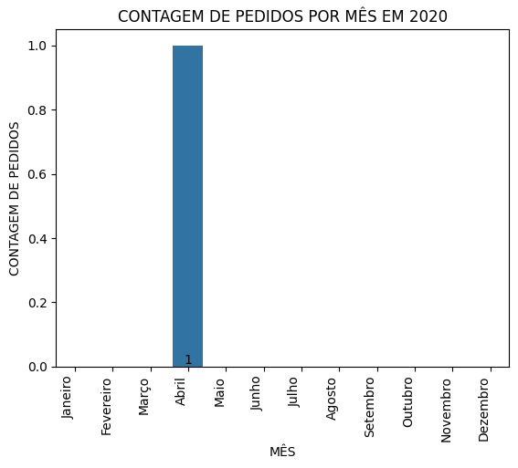

## Análise de dados públicos relacionados ao e-commerce brasileiro

## Questão 1: Análise de Performance de Vendas
###
### 
###
## Questão 2: Análise de Logística
###
###
###
## Questão 3: Análise de Satisfação do Cliente
###
###
###
## Questão 4: Análise Financeira
###
###
###
## Questão 5: Análise de Marketing
###
###
###